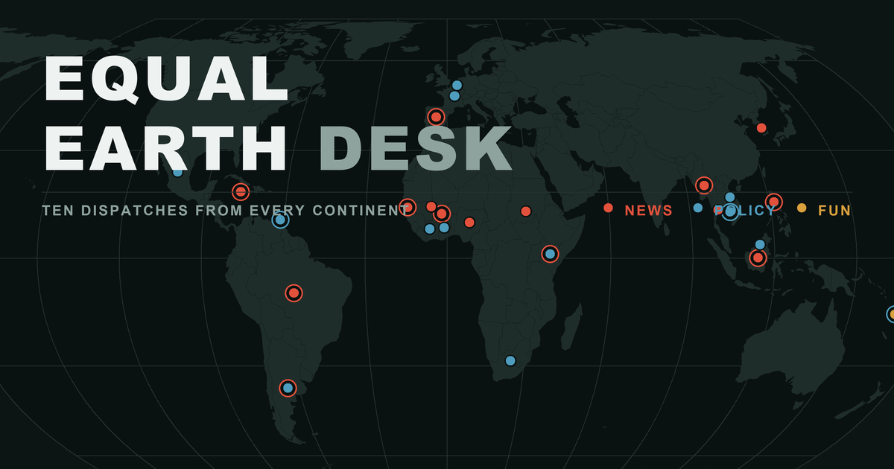

# Equal Earth Desk

[Visit the live desk](https://dopedolly.github.io/equal-earth-desk/)

Equal Earth Desk is a global news publication built around an interactive Equal Earth map. Each issue presents a concise selection of news, policy changes, and unusually revealing stories from across the world's continents while preserving countries' true relative areas.

The publication is intentionally lightweight. It has no backend, database, framework, build step, paid API, or package manager. The complete public website lives in a single `index.html` file and is hosted with GitHub Pages.

## Editorial model

The reader is American; America is not the center. Stories are selected for their importance where they happened, with room for events that are unusually significant for a country relative to its own recent baseline.

The selection and writing rules are documented in [`EDITORIAL_CHARTER.md`](EDITORIAL_CHARTER.md).

## Updating an issue

1. Open the live site with `#edit` appended to its URL.
2. Copy the built-in research prompt and use it with any web-enabled model.
3. Paste the returned story JSON into the editor.
4. Run **Check & preview** and review every source.
5. Download the updated `index.html` and commit it to `main`.

GitHub Pages publishes the updated issue automatically.

## Critical map rule

Never rewrite, reformat, regenerate, or prettify `const MAP` inside `index.html`. The generated geometry must remain intact. Routine issue updates should change only the marked `ISSUE` and `STORIES` block.

## Public files

- `index.html`: the complete publication, interactive map, issue data, and editor.
- `preview.png`: the 1200 by 630 social link-preview image.
- `EDITORIAL_CHARTER.md`: the public editorial charter.
- `README.md`: this project overview.

A KDY Project.
